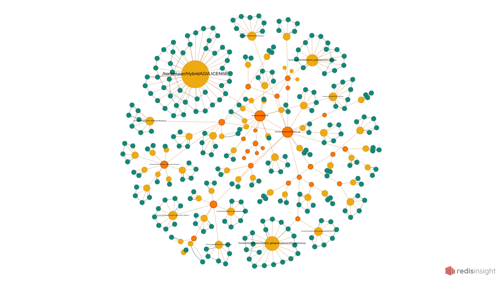

## Unveiling the Power of Hybrid AGI Meta Knowledge Graph

Prepare to delve into the fascinating world of Hybrid AGI meta knowledge graph! This structure, also known as metagraph, play a crucial role in capturing and organizing the intricate web of information within an AGI's hybrid memory. Let's explore the concept of metagraph and uncover its potential for enabling effective reasoning and knowledge representation.

### The Meta Knowledge Graph in Hybrid AGI

The meta knowledge graph, or metagraph, is a foundational structure that serves as a comprehensive representation of an AGI's hybrid memory. It provides a hierarchical view of documents, folders, and their associated structures, enabling the AGI system to reason effectively across multiple levels of abstraction. By capturing the interconnections and relationships among these elements, the metagraph forms the backbone of knowledge organization within the Hybrid AGI.

To gain a visual understanding of the metagraph, you can utilize RedisInsight, a browser-based tool. Open RedisInsight and navigate to the RedisGraph tab, where you can explore the `graph:metagraph` in the graph list. This visualization presents the metagraph of the Hybrid AGI, with folders represented in orange, documents in yellow, and content in blue. It offers a powerful visual representation of the AGI's own memory and the relationships between folders, documents, and their content.

### Schema of the Metagraph

To effectively design and interact with the Hybrid AGI meta knowledge graph, it is essential to understand its schema within RedisGraph. The metagraph schema consists of various labels, properties, and relationship types that define the structure and organization of information.

#### Labels:

- Folder: Represents a folder within the meta knowledge graph.
- Document: Represents a document within the meta knowledge graph.
- Content: Represents a chunk of content extracted from a document.
- Graph: Represents a graph within the graph memory.
- Summary: Represents a summary associated with a content, document, or folder.

#### Properties:

- Folder:
  - name: The name of the folder.
- Document:
  - name: The name of the document.
- Content:
  - name: The index of the content within the vector memory.
- Graph:
  - name: The index of the graph within the graph memory.
- Summary:
  - name: The index of the summary within the vector memory.

#### Relationship Types:

- REPRESENTS: Represents the relationship when a graph represents a content, document, or folder within the meta knowledge graph.
- SUMMARIZES: Represents the relationship when a summary summarizes a content, document, or folder within the meta knowledge graph.
- CONTAINS: Represents the composition relationship between contents, graphs, summaries, and folders within the meta knowledge graph.
- BOF (Beginning of File): Represents the starting content of a document within the meta knowledge graph.
- EOF (End of File): Represents the ending content of a document within the meta knowledge graph.
- NEXT: Represents the next content in the sequence of a document within the meta knowledge graph.

By leveraging these labels, properties, and relationship types, the Hybrid AGI system can effectively navigate, retrieve, and reason with the information stored in the meta knowledge graph.

With a firm understanding of the Hybrid AGI meta knowledge graph and its underlying schema, you now possess the key to unlocking its immense potential for knowledge representation and reasoning within the AGI system. Embark on this transformative journey and harness the power of the metagraph to advance the capabilities of Hybrid AGI.