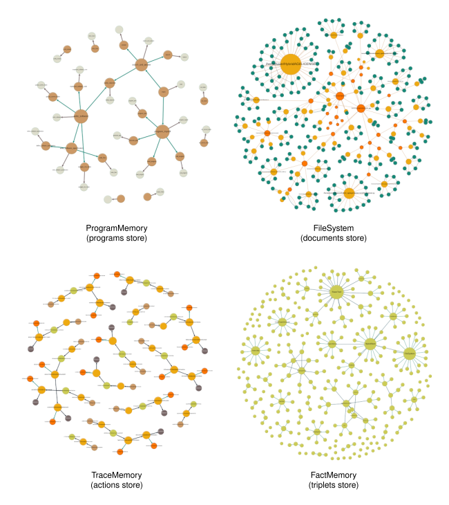
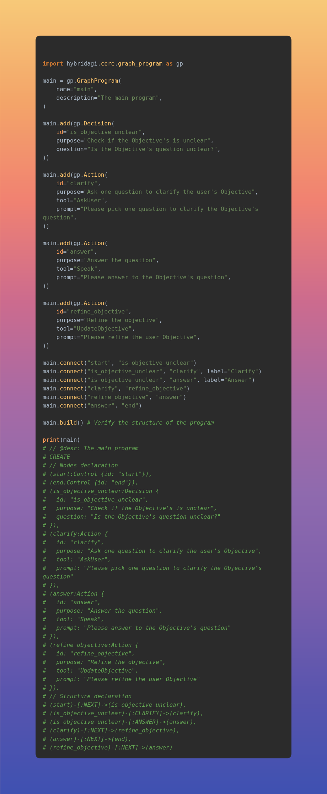
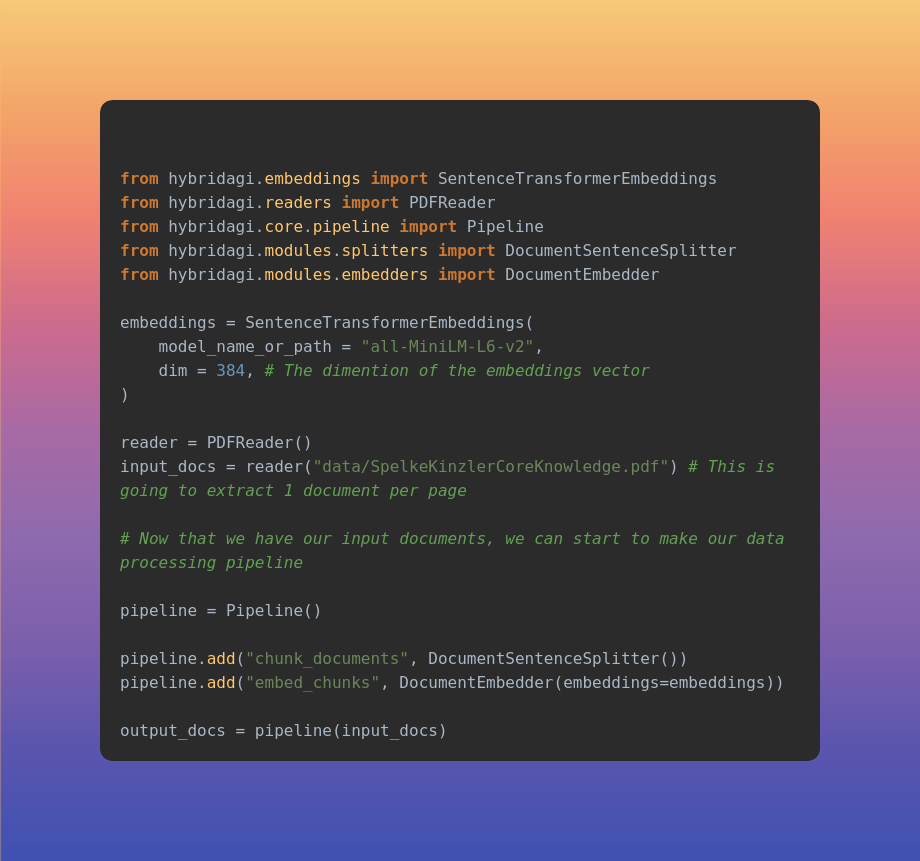
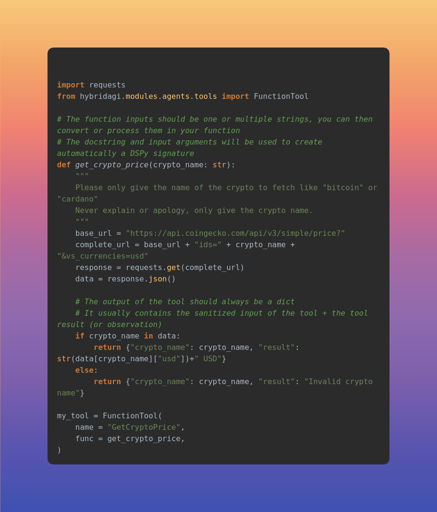

# HybridAGI: for people who want AI to behave as expected
## The (self)Programmable Cypher-based Neuro-Symbolic AGI

### Your All-In-One framework for interactive knowledge intensive LLM applications

<div align="center">

[](https://pepy.tech/project/hybridagi)
[](https://github.com/SynaLinks/HybridAGI/actions/workflows/python-package.yaml)

[](https://opensource.org/license/gpl-3-0/)

</div>

### LLM Agent as Graph VS LLM Agent as Graph Interpreter

What makes our approach different from Agent as Graph is the fact that our Agent system is not a process represented by a graph, but an interpreter that can read/write and execute a graph data (the graph programs) structure separated from that process. Making possible for the Agent to learn by executing, reading and modifying the graph programs (like any other data), in its essence HybridAGI is intended to be a self-programming system centered around the Cypher language. It is a production-ready research project centered around neuro-symbolic programming, program synthesis and symbolic AI.

## Key Features

- **Turing Complete DSL**: HybridAGI's Turing Complete Domain Specific Language (DSL) has been specifically designed to describe an infinite number of algorithms using only 4 different types of nodes (Control, Action, Decision, Program). The interpreter Agent can loop and call subprograms, similar to a traditional programming language.

- **Graph Program Search & Dynamic Call**: Because our agent system is not a static finite state machine but an interpreter that interprets a graph-based DSL node by node, it can search programs into memory and dynamically call the best one to solve the user query.

- **Optimizable Pipeline & Agent**: With HybridAGI and DSPy, you can optimize the data processing pipelines and the agent system to your own needs. Since each HybridAGI module is also a DSPy module, you can use DSPy optimizers seamlessly with them.

- **Agent Behavior as Software**: With HybridAGI, you can ship the Agent's behavior as Cypher software, enabling start-ups and companies to create their own IP based on their business logic implemented in Cypher.

- **Memory-Centric System**: HybridAGI is a memory-centric system that heavily uses Knowledge Graphs, both for executing programs and to store structured knowledge. This enables Knowledge Graph RAG applications for critical domains.

- **Secure and Safe**: Special attention has been given to prevent Cypher Injections but also to prevent the Agent system from modifying its own main prompting mechanism by introducing the concept of protected programs.

- **Predictable/Deterministic behavior and infinite number of tools**: Because we don't let the Agent choose the sequence of tools to use, we can use an infinite number of tools. By following the Graph Programs, we ensure a predictable and deterministic methodology for our Agent system. We can combine every memory system into one unique Agent by using the corresponding tools without limitation.

## Notebooks

- [Datatypes](notebooks/datatypes.ipynb)
- [GraphPrograms](notebooks/graph_programs.ipynb)
- [Interpreter Prompting](notebooks/interpreter_prompting.ipynb)
- [Simulating User](notebooks/simulating_user.ipynb)
- [Vector Only RAG](notebooks/vector_only_rag.ipynb)
- [Knowledge Graph RAG](notebooks/knowledge_graph_rag.ipynb)
- [Episodic RAG](notebooks/episodic_memory_rag.ipynb)
- [Extracting Knowledge Graphs](notebooks/extracting_knowledge_graphs.ipynb)
- [Dynamic Graph Program](notebooks/dynamic_graph_program.ipynb)
- [Using External Tools](notebooks/using_external_tools.ipynb)
- [Add Documents (on the fly)](notebooks/updating_documents.ipynb)
- [Add Facts (on the fly)](notebooks/updating_facts.ipynb)
- [Interactive ReACT](notebooks/interactive_react.ipynb)
- [ReACT Agent](notebooks/react_agent.ipynb)
- [Reflexion Agent](notebooks/reflexion_agent.ipynb)
- [Using FalkorDB](notebooks/using_falkordb.ipynb)

## What is HybridAGI?

HybridAGI is the first programmable LLM-based Agent that enables you to define its behavior using a **graph-based prompt programming** approach. Unlike other frameworks that view agents as advanced chatbots, we have adopted a methodology that is rooted in computer science, cognitive sciences, and symbolic AI.

To us, an agent system is an goal-directed cognitive software that can process natural language and execute the tasks it has been programmed to perform. Just like with traditional software, the developer specifies the behavior of the application, and the system is not truly autonomous unless it has been programmed to be so. Programming the system not only helps the agent to carry out its tasks but also allows for the *formalization of the developer's intent*.

HybridAGI is designed for data scientists, prompt engineers, researchers, and AI enthusiasts who love to experiment with AI. It is a "Build Yourself" product that focuses on human creativity rather than AI autonomy.

### Install

#### With pip (recommended)

To install easily HybridAGI we recommend you to use pip with the following command:
```
pip install hybridagi
```

#### From sources

If you want to explore more in depth our system, or contribute to the project, you can use the following command to install HybridAGI from sources:
```
git clone https://github.com/SynaLinks/HybridAGI
cd HybridAGI
pip install .
```

### Graphs for planning and knowledge management, no finetuning required.

<div align="center">



</div>

**No React Agents here**, the only agent system that we provide is our custom **Graph Interpreter Agent** that follow a strict methodology by executing node by node the graph programs it have in memory. Because we control the behavior of the Agent from end-to-end by offloading planning to symbolic components, we can correct/enhance the behavior of the system easely, removing the needs for finetuning but also allowing the system to learn on the fly.

HybridAGI is build upon years of experience in making reliable Robotics systems. We have combined our knowledge in Robotics, Symbolic AI, LLMs and Cognitive Sciences into a product for programmers, data-scientists and AI engineers. The long-term memory of our Agent system heavily use graphs to store structured and unstructured knowledge as well as its graph programs.

We provide everything for you to build your LLM application with a focus around Cypher Graph databases. We provide also a local database for rapid prototyping before scaling your application with one of our integration.

<div align="center">



</div>

### Modular Pipelines

With HybridAGI you can build data extraction pipelines, RAG applications or advanced Agent systems, each being possibly optimized by using DSPy optimizers. We also provide pre-made modules and metrics for easy prototyping.

Each module and data type is *strictly typed and use Pydantic* as data validation layer. You can build pipelines in no time by stacking Modules sequentially like in Keras or HuggingFace.

<div align="center">



</div>

### Native tools

We provide the following list of native tools to R/W into the memory system or modify the state of the agent:
<div align="center">

| Tool Name      | Usage      |
| -------------- | ------------- |
| `Predict`        | Used to populate the context with reasoning information |
| `ChainOfThought` | Used to populate the context with reasoning information |
| `Speak` | Used to send message to the User and give the final answer |
| `AskUser` | Used to ask question to the User (can simulate the user persona) |
| `UpdateObjective` | Update the long-term Objective of the Agent |
| `AddDocument` | Save into memory a new document |
| `AddFact` | Save into memory new facts |
| `AddGraphProgram` | Save into memory new program (override if existing) |
| `DocumentSearch` | Used to search for information into the document memory |
| `PastActionSearch` | Used to search for past actions into the trace memory |
| `EntitySearch` | Used to search for entities into the fact memory |
| `FactSearch` | Used to search for facts into the fact memory |
| `GraphProgramSearch` | Used to search for graph programs into the program memory |
| `ReadGraphProgram` | Used to read a graph program from memory by name |
| `CallGraphProgram` | Used to dynamically call a graph program from memory by name |

</div>

### Adding more tools

You can add more tools by using the `FunctionTool` and python functions like nowadays function calling.

<div align="center">



</div>

### Graph Databases Integrations

- Local Graph Memory for rapid prototyping based on [NetworkX](https://networkx.org/).
- [FalkorDB](https://www.falkordb.com/) low latency in-memory hybrid vector/graph database.
- [Kuzu](https://kuzudb.com/) A highly scalable, extremely fast, easy-to-use embeddable graph database (coming soon).

We accept the contributions for more database integrations. Feel free to join the discord channel for more information!

# FAQ

## Frequently Asked Questions

### Why HybridAGI?

We are dissatisfied with the current trajectory of agent-based systems that lack control and efficiency. Today's approach involves building React/MKRL agents that operate independently without human control, often leading to infinite loops of nonsense due to their tendency to stay within their data distribution. Multi-agent systems attempt to address this issue, but they often result in more nonsense and prohibitive costs due to the agents' chitchat. Additionally, today's agents often require fine-tuning to enhance or correct their behavior, which can be a time-consuming and complex process.

With HybridAGI, the only thing you need to do is modify the behavior graph (the graph programs). We believe that fine-tuning should be a last resort when in-context learning fails to yield the desired results. By rooting cognitive sciences into computer science concepts, we empower programmers to build the agent system of their dreams by controlling the sequence of action and decision. Our goal is to build an agent system that can solve real-world problems by using an intermediary language that is interpretable by both humans and machines. If we want to keep humans in the loop in the coming years, we need to design agent systems for that purpose.

### What is the difference between LangGraph and HybridAGI?

LangGraph is built on top of LangChain, which was also the case for HybridAGI last year. However, given the direction of the LangChain team towards encouraging ReACT agents that lack control and explainability, we switched to DSPy, which provides better value by focusing on pipelines optimization. Recently, LangGraph has emerged to compensate for the poor decision-making of LangChain, but we had already proven the value of our work. Moreover, LangGraph, like many agentic frameworks, describes a static finite state machine. Our vision of AGI systems is that being Turing complete is required, which is the case for many agentic frameworks, but having the capability of programming itself on the fly (meaning real continuous learning) is also required to truly begin the AGI journey, which is lacking in other frameworks.

### What is the difference between Llama-Index and HybridAGI?

Llama-Index recently released an event-driven agent system, similar to LangGraph, it is a static state machine, and the same remarks apply to their work.

### What is the difference between DSPy and HybridAGI?

HybridAGI is built on top of the excellent work of the DSPy team, and it is intended as an abstraction to simplify the creation of complex DSPy programs in the context of LLM Agents. DSPy is more general and is also used for simpler tasks that don't need agentic systems. Unlike DSPy, our programs are not static but dynamic and can adapt to the user query by dynamically calling programs stored in memory. Moreover, we focus our work on explainable neuro-symbolic AGI systems using Graphs. The graph programs are easier to build than implementing them from scratch using DSPy. If DSPy is the PyTorch of LLM applications, think of HybridAGI as the Keras or HuggingFace of neuro-symbolic LLM agents.

### What is the difference between OpenAI o1 and HybridAGI?

OpenAI o1 and HybridAGI share many common goals, but they are built with different paradigms in mind. Like OpenAI o1, HybridAGI uses multi-step inferences and is a goal-oriented agent system. However, unlike OpenAI o1, we guide the CoT trace of our agent system instead of letting it explore freely its action space, a paradigm more similar to an A* where the Agent navigates in a defined graph instead of a Q-learning one. This results in more efficient reasoning, as experts can program it to solve a particular use case. We can use smaller LLMs, reducing the environmental impact and increasing the ROI. The downside of our technology is that you need expert knowledge in your domain as well as in programming and AI systems to best exploit its capabilities. For that reason, we provide audit, consulting, and development services to people and companies that lack the technical skills in AI to implement their system.

### Who are we?

We're not based in Silicon Valley or part of a big company; we're a small, dedicated team from the south of France. Our focus is on delivering an AI product where the user maintains control. We're dissatisfied with the current trajectory of agent-based products. We are experts in human-robot interactions and building interactive systems that behave as expected. While we draw inspiration from cognitive sciences and symbolic AI, we aim to keep our concepts grounded in computer science for a wider audience.

Our mission extends beyond AI safety and performance; it's about shaping the world we want to live in. Even if programming becomes obsolete in 5 or 10 years, replaced by some magical prompt, we believe that traditional prompts are insufficient for preserving jobs. They're too simplistic and fail to accurately convey intentions.

In contrast, programming each reasoning step demands expert knowledge in prompt engineering and programming. Surprisingly, it's enjoyable and not that difficult for programmers, as it allows you to gain insight into how AI truly operates by controlling it. Natural language combined with algorithms opens up endless possibilities. We can't envision a world without it.

### How do we make money?

We are providing audit, consulting, and development services for businesses that want to implement neuro-symbolic AI solutions in various domains, from computer vision to high-level reasoning with knowledge graph/ontology systems in critical domains like health, biology, financial, aerospace, and many more.

HybridAGI is a research project to showcase our capabilities but also to bring our vision of safe AGI systems for the future. We are a bootstrapped start-up that seeks real-world use cases instead of making pretentious claims to please VCs and fuel the hype.

Because our vision of LLMs capabilities is more moderate than others, we are actively looking to combine different fields of AI (evolutionary, symbolic, and deep learning) to make this leap into the future without burning the planet by relying on scaling alone. Besides the obvious environmental impacts, by relying on small/medium models, we have a better understanding and the capability to make useful research without trillion-worth datacenters.

HybridAGI is our way to be prepared for that future and at the same time, showcase our understanding of modern and traditional AI systems. HybridAGI is the proof that you don't need billion of dollars to work on AGI systems, and that a small team of passionate people can make the difference.

### Why did we release our work under GNU GPL?

We released HybridAGI under GNU GPL for various reasons, the first being that we want to protect our work and the work of our contributors. The second reason is that we want to build a future for people to live in, without being dependent on Big AI tech companies, we want to empower people not enslave them by destroying the market and leaving people jobless without a way to become proprietary of their knowledge. HybridAGI is a community project, by the community, for the community. Finally, HybridAGI is a way to connect with talented and like-minded people all around the world and create a community around a desirable future.

### Is HybridAGI just a toolbox?

Some could argue that HybridAGI is just a toolbox. However, unlike LangChain or Llama-Index, HybridAGI has been designed from the ground up to work in synergy with a special-purpose LLM trained on our DSL/architecture. We have enhanced our software thanks to the community and because we are the ones who created our own programming language, we are also the best people to program it. We have accumulated data and learned many augmentation techniques and cleaned our datasets during the last year of the project to keep our competitive advantage. We might release the LLM we are building at some point in time when we decide that it is beneficial for us to do so.

### Can I use HybridAGI commercially?

Our software is released under GNU GPL license to protect ourselves and the contributions of the community. The logic of your application being separated (the graph programs) there is no IP problem for you to use HybridAGI. Moreover, when used in production, you surely want to make a FastAPI server to request your agent and separate the backend and frontend of your app (like a website), so the GPL license doesn't contaminate the other pieces of your software. We also provide dual-licensing for our clients if needed.

## Get Involved

[](https://discord.gg/82nt97uXcM)

Become a part of our community of developers, researchers, and AI enthusiasts. Contribute to the project, share your feedback, and help shape the future of HybridAGI. We welcome and value your participation!

## Contributors

<a href="https://github.com/SynaLinks/HybridAGI/graphs/contributors">
  
</a>

## Star History

[](https://star-history.com/#SynaLinks/HybridAGI&Date)