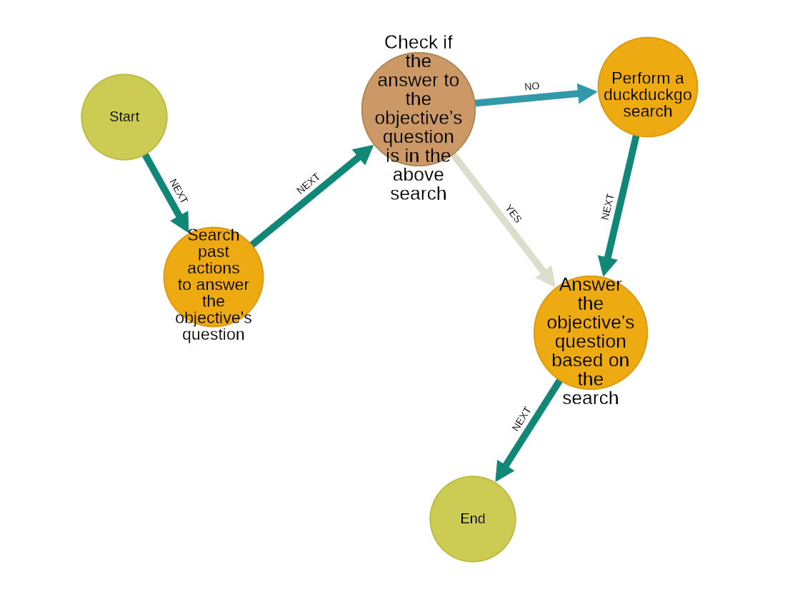

# HybridAGI: The Programmable Neuro-Symbolic AGI
### For people who want AI to behave as expected


[](https://opensource.org/license/gpl-3-0/)
[](https://synalinks.github.io/documentation)
---
[](https://discord.gg/82nt97uXcM)

<p align="center">
  <a href="https://www.youtube.com/watch?v=ZNjXU4L1OsU">
    
  </a>
</p>

**Notebooks:** 
- [First Steps](notebooks/first_steps.ipynb)
- [Using Variables](notebooks/using_variables.ipynb)
- [Code Interpreter](notebooks/code_interpreter.ipynb)
- [Episodic Memory](notebooks/episodic_memory.ipynb)
- [Optimizing Pipelines](notebooks/optimizing_pipelines.ipynb)
- [Dynamic Program](notebooks/dynamic_program.ipynb)

More to come, join the discord to suggest more examples

## What is HybridAGI?

HybridAGI is an AgentOS framework designed for creating explainable and deterministic agent systems suitable for real-world applications.

It is the first programmable LM-based Agent that enables you to define its behavior using a **graph-based prompt programming** approach. Unlike other frameworks that view agents as advanced chatbots, we have adopted a methodology that is rooted in computer science, cognitive sciences, and symbolic AI.

If DSPy is the PyTorch of LMs Applications, HybridAGI is the equivalent of Keras for LMs Agents systems. HybridAGI is designed for data scientists, prompt engineers, researchers, and AI enthusiasts who love to experiment with AI. It is a "Build Yourself" product that focuses on human creativity rather than AI autonomy.

<p align="center">
  
  <figcaption align="center"><b>HybridAGI's AgentOS architecture. The Graph Program Interpreter orchestrate every other component using tools as Action. It can also interact with the user during the execution of a program.</b></figcaption>
</p>

<figure>
  <p align="center">
    
    <figcaption align="center"><b>Fig.2 - HybridAGI's long-term memory. Each memory system can be used with each other providing the best of vectors and graph retrieval.</b></figcaption>
  </p>
</figure>

## Why HybridAGI?

We are not satisfied with the current trajectory of Agent-based systems that lack control and efficiency. Today's approach is to build React/MKRL agents that do what they want without any human control, resulting in infinite loops of nonsense because they tend to stay in their data distribution. Multi-agent systems try to solve that, but instead result in more nonsense and prohibitive costs due to the agents chitchatting with each other. Moreover, today's agents require fine-tuning to enhance/correct the behavior of the agent system. In contrast, with HybridAGI, the only thing you need to do is to modify the behavior graph.

We advocate that fine-tuning should be done only as a last resort when in-context learning fails to give you the expected result. Any person who has already fine-tuned a LM knows that gathering data is hard, but having the right variability in your dataset is even harder, thus prohibiting most companies from leveraging this technology if they don't have many AI scientists. By rooting cognitive sciences into computer science concepts, without obfuscating them, we empower programmers to build the Agent system of their dreams by controlling the sequence of action and decision.

Our goal is to build an agent system that solves real-world problems by using an intermediary language interpretable by both humans and machines. If we want to keep humans in the loop in the coming years, we need to design Agent systems for that purpose.

### Deterministic approach & infinite number of tools

To us, an agent system is an goal-directed cognitive software that can process natural language and execute the tasks it has been programmed to perform. Just like with traditional software, the developer specifies the behavior of the application, and the system is not truly autonomous unless it has been programmed to be so. Programming the system not only helps the agent to carry out its tasks but also allows for the *formalization of the developer's intent*.

Our approach reduces the need for fine-tuning, as we can control the behavior of the system in a deterministic way from end to end. You will **not** find any React/MKRL agents in our implementation, unlike in traditional agent frameworks such as LangChain/LangGraph or Llama-Index. Furthermore, our approach enables the system to handle an unlimited number of tools, as we do not allow the system to decide which one to use at each step.

### Automatic optimization & hybrid vector/graph long-term memory

HybridAGI is also a machine learning framework that emphasizes the importance of evaluating and optimizing LM-based systems thanks to the integration of DSPy. You can automatically optimize/fine-tune the prompts sent to the LM based on the dataset/examples provided to the system*.

We also emphasize the importance of centralizing knowledge into a hybrid vector/graph database. This low-latency graph database allows the system to efficiently memorize and scale knowledge.

*Note: Our approach only optimizes/fine-tunes the atomic steps of the system, the sequence of actions and decisions is *always* controlled by the graph programs.

### Memory-centric system

The long-term memory is another aspect where HybridAGI is unique. First we centralize knowledge, documents, programs and traces into an hybrid vector/graph database. But we also provide for the system tools to interact with it, thanks to the behavior graph we can use an unlimited number of tools making possible to combine every memory into a unique Agent. Unlike other frameworks that view agents as chatbots we see them as software, as such the memories implemented are very different from others frameworks.

<figure>
  <p align="center">
    
    <figcaption align="center"><b>Fig.2 - HybridAGI long-term memory. Each memory system can be used with each other providing the best of vectors and graph retrieval.</b></figcaption>
  </p>
</figure>

### Graph-based prompt programming

Graph-based Prompt Programming is one of the key features of HybridAGI, in its essence it is a programming language for LM Agents that allow probabilistic conditional loops and multi-output decisions. This language is based on **[Cypher](https://en.wikipedia.org/wiki/Cypher_(query_language))** a well known language for graph databases. Like any programming language, it always start with a main program:

main.cypher:
```javascript
// Nodes declaration
CREATE
(start:Control {name:"Start"}),
(end:Control {name:"End"}),
(answer:Action {
    name:"Answer the objective's question",
    tool:"Speak",
    prompt:"Answer the objective's question"
}),
// Structure declaration
(start)-[:NEXT]->(answer),
(answer)-[:NEXT]->(end)
```

You can also describe conditional loops or multi-output choices using decision nodes like in this program:

clarify_objective.cypher:
```javascript
// @desc: Clarify the objective if needed
CREATE
// Nodes declaration
(start:Control {name:"Start"}),
(end:Control {name:"End"}),
(is_anything_unclear:Decision {
    name:"Check if the objective is unclear", 
    question:"Is the objective still unclear?"
}),
(ask_question:Action {
    name:"Ask question to clarify the objective",
    tool:"AskUser",
    prompt:"Pick one question to clarify the Objective"
}),
(refine_objective:Action {
    name:"Clarify the given objective",
    tool:"UpdateObjective", 
    prompt:"The refined Objective"
}),
// Structure declaration
(start)-[:NEXT]->(is_anything_unclear),
(ask_question)-[:NEXT]->(refine_objective),
(refine_objective)-[:NEXT]->(is_anything_unclear),
// The outgoing edges of decision nodes give
// the possible answers to the system
(is_anything_unclear)-[:YES]->(ask_question),
// Decisions can have multiple arbitrary outcomes
(is_anything_unclear)-[:MAYBE]->(ask_question),
(is_anything_unclear)-[:NO]->(end)
```

And you can obviously also call other programs, here is an updated version of our main program:

main.cypher
```javascript
// Nodes declaration
CREATE
(start:Control {name:"Start"}),
(end:Control {name:"End"}),
// This node will call the `clarify_objective` program
(clarify_objective:Program {
    name:"Clarify the objective if needed",
    program:"clarify_objective"
}),
(answer:Action {
    name:"Answer the objective's question",
    tool:"Speak",
    prompt:"Answer the objective's question"
}),
// Structure declaration
(start)-[:NEXT]->(clarify_objective),
(clarify_objective)-[:NEXT]->(answer),
(answer)-[:NEXT]->(end)
```

Here is the trace of the above example, note that the system can simulate user inputs to optimize/finetune itself without human intervention.

```
 --- Step 0 ---
Call Program: main
Program Purpose: What's the meaning of life?
 --- Step 1 ---
Call Program: clarify_objective
Program Purpose: Clarify the objective if needed
 --- Step 2 ---
Decision Purpose: Check if the objective is unclear
Decision Question: Is the objective still unclear?
Decision: MAYBE
 --- Step 3 ---
Action Purpose: Ask question to clarify the objective
Action: {
  "question": "Do you mean to ask about the philosophical or personal significance of life in general, or are you asking for guidance on finding personal fulfilment and satisfaction?",
  "answer": "I believe in seeking personal growth and happiness. For me, the meaning of life could be finding joy in relationships, pursuing passions, and making a positive impact on the world. However, this question is deeply philosophical and can have many interpretations."
}
 --- Step 4 ---
Action Purpose: Clarify the given objective
Action: {
  "new_objective": "Which aspects of personal growth, relationships, passions, and making a positive impact on the world should I focus on to find meaning and satisfaction in my life?",
  "observation": "Successfully updated"
}
 --- Step 5 ---
Decision Purpose: Check if the objective is unclear
Decision Question: Is the objective still unclear?
Decision: NO
 --- Step 6 ---
End Program: clarify_objective
 --- Step 7 ---
Action Purpose: Answer the objective's question
Action: {
  "message": "To find meaning and satisfaction in your life, consider focusing on various aspects of personal growth, relationships, passions, and making a positive impact on the world. Here are some suggestions for each area:\n\n1. Personal Growth: Continuously learn new skills, read books, travel, practice mindfulness, set goals, and engage in activities that challenge you and help you grow as an individual.\n2. Relationships: Nurture your existing relationships by actively listening, expressing gratitude, and showing empathy. Build new connections through networking, joining clubs or groups, and volunteering.\n3. Passions: Pursue hobbies or activities that bring you joy and fulfilment. Dedicate time to these passions regularly, and consider sharing them with others to expand your network and learn from their experiences.\n4. Making a Positive Impact on the World: Identify causes or issues that resonate with you and find ways to contribute to them. Volunteer, donate, spread awareness, or engage in activism. Remember that even small actions can make a significant difference.\n\nFeel free to ask any questions or clarifications regarding this response."
}
 --- Step 8 ---
End Program: main
```

HybridAGI output the chat history, along with the final answer and trace allowing DSPy to optimize every aspect of a conversational agent: the result, the intermediary steps but also the interaction with the user.

```
[
  {
    "role": "User",
    "message": "What's the meaning of life?"
  },
  {
    "role": "AI",
    "message": "Do you mean to ask about the philosophical or personal significance of life in general, or are you asking for guidance on finding personal fulfilment and satisfaction?"
  },
  {
    "role": "User",
    "message": "I believe in seeking personal growth and happiness. For me, the meaning of life could be finding joy in relationships, pursuing passions, and making a positive impact on the world. However, this question is deeply philosophical and can have many interpretations."
  },
  {
    "role": "AI",
    "message": "To find meaning and satisfaction in your life, consider focusing on various aspects of personal growth, relationships, passions, and making a positive impact on the world. Here are some suggestions for each area:\n\n1. Personal Growth: Continuously learn new skills, read books, travel, practice mindfulness, set goals, and engage in activities that challenge you and help you grow as an individual.\n2. Relationships: Nurture your existing relationships by actively listening, expressing gratitude, and showing empathy. Build new connections through networking, joining clubs or groups, and volunteering.\n3. Passions: Pursue hobbies or activities that bring you joy and fulfilment. Dedicate time to these passions regularly, and consider sharing them with others to expand your network and learn from their experiences.\n4. Making a Positive Impact on the World: Identify causes or issues that resonate with you and find ways to contribute to them. Volunteer, donate, spread awareness, or engage in activism. Remember that even small actions can make a significant difference.\n\nFeel free to ask any questions or clarifications regarding this response."
  }
]
```

Learn more about Graph-based Prompt Programming by reading our [documentation](https://synalinks.github.io/documentation/basics/graph-prompt-programming).

### Install using pip

```bash
pip install git+https://github.com/SynaLinks/HybridAGI.git
```

Note: Before installing `hybridagi` we recommand you to create a virtual environment using virtualenv, conda or your preferred environment manager.

### Setup the Knowledge Base (needed for the system to work)

Then setup the knowledge base using docker:

```bash
docker run -p 6379:6379 -p 3000:3000 -it --rm falkordb/falkordb:edge
```

## Usage

### Setting up your pipeline

```python
from hybridagi import HybridAGI

agent = HybridAGI(
  agent_name = "qa_agent",
)

# Load all the graphs programs (.cypher files) of the given folder
agent.add_programs_from_folders(["my_programs"])

prediction = agent.execute("What is the city of the spacial and robotics industry in France?")

print(prediction.final_answer)
```

### Adding knowledge

```python
# You can add your data by loading an entire folder (keep in mind that we preserve the tree structure)
# Support .txt .py and .md files at the moment
# The list of supported types will be expanded in the coming weeks (pdf, csv etc.)
agent.add_knowledge_from_folders(["my_data"])
```

### Optimizing the pipeline

```python
# First we import an already made metric
from hybridagi.metrics import factual_answer

trainset = [
  dspy.Example(objective="What is the city of the spacial and robotics industry in France?").with_inputs("objective"),
  dspy.Example(objective="What is a neuro-symbolic artificial intelligence?").with_inputs("objective"),
  dspy.Example(objective="What is prompt self-refinement?").with_inputs("objective"),
  dspy.Example(objective="How might advancements in artificial intelligence impact the future job market?").with_inputs("objective"),
  dspy.Example(objective="What ethical considerations should be taken into account regarding the integration of AI into various job sectors?").with_inputs("objective"),
]

valset = [
  dspy.Example(objective="What are the negative implications of AI for the gig economy and freelance work?").with_inputs("objective"),
  dspy.Example(objective="What are some potential industries or professions that could be significantly affected by AI in the coming years? list 5 of them").with_inputs("objective"),
  dspy.Example(objective="How can individuals prepare themselves for a future where AI plays a more prominent role in the workforce?").with_inputs("objective"),
]

agent.optimize(
  trainset = trainset, # the training dataset
  valset = valset, # the validation dataset
  metric = factual_answer, # this metric check that the final answer is factually correct according to the trace
)
```

### Adding your own tools

```python

def greet(**kwargs):
    """
    This function greets the person passed in as a parameter
    """
    name = kwargs["name"] # The function inputs need to use python **kwargs keywords arguments
    # Here goes your tool logic
    message = f"Hello, {name}. Nice to meet you!"
    print(message)
    # You have then to returns the output of your function as a dict
    output = {}
    output["message"] = message
    return output

my_custom_tool = Tool(
    name = "Greet", # The name of the tool
    signature = "name -> message", # The function signature (multi input/output are possible like in DSPy signature)
    instructions = "Greet a person", # The tool instruction
    func = greet, # And the callable function
    lm = my_lm # You can optionally use another LM to infer the inputs of the tool
)

agent.add_tools([my_custom_tool])
```

### Native Tools


## Credits 👏

HybridAGI is made possible by the following open-source tools:

- [DSPy](https://dspy-docs.vercel.app/) framework
- [FalkorDB](https://www.falkordb.com/) database

## Contributors 🔥

<a href="https://github.com/SynaLinks/HybridAGI/graphs/contributors">
  
</a>

## Cite this work

If you found this repository usefull for your research, please consider citing us:

```bibtex
@misc{Sallami2023,
  author = {Yoan Sallami},
  title = {HybridAGI: Introducing graph-based prompt programming},
  year = {2023},
  publisher = {GitHub},
  journal = {GitHub repository},
  howpublished = {\url{https://github.com/SynaLinks/HybridAGI}}
}
```

## Get Involved 💬
[](https://discord.gg/82nt97uXcM)

Become a part of our community of developers, researchers, and AI enthusiasts. Contribute to the project, share your feedback, and help shape the future of HybridAGI. We welcome and value your participation!

## Who we are? 🔥

We're not based in Silicon Valley or part of a big company; we're a small, dedicated team from the south of France. Our focus is on delivering an AI product where the user maintains control. We're dissatisfied with the current trajectory of Agent-based products. We are expert in human-robot interactions and building interactive systems that behave as expected. While we draw inspiration from cognitive sciences and symbolic AI, we aim to keep our concepts grounded in computer science for a wider audience.

Our mission extends beyond AI safety and performance; it's about shaping the world we want to live in. Even if programming becomes obsolete in 5 or 10 years, replaced by some magical prompt, we believe that traditional prompts are insufficient for preserving jobs. They're too simplistic and *fail to accurately convey intentions*.

In contrast, programming each reasoning step demands expert knowledge in prompt engineering and programming. Surprisingly, it's enjoyable and not that difficult for programmers, you'll gain insight into how AI truly operates by controlling it, beeing able to enhance the sequence of action and decision. Natural language combined with algorithms opens up endless possibilities. We can't envision a world without it.

## Star History

[](https://star-history.com/#SynaLinks/HybridAGI&Date)